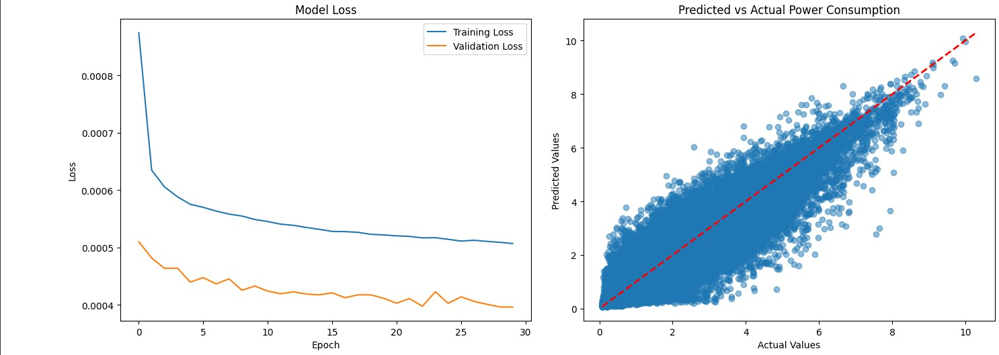
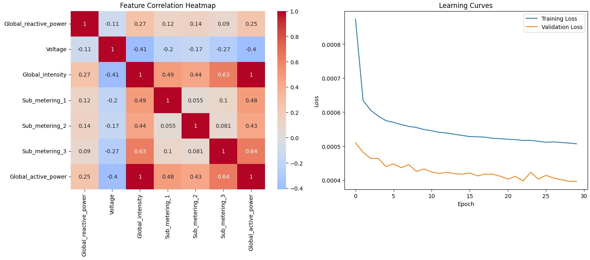

> 🇬🇧 Read this README in English: [README.md](README.md)

# ⚡ Stromverbrauch-Vorhersage mit Recurrent Neural Networks (RNN)

Dieses Projekt zeigt, wie ein **Recurrent Neural Network (RNN)** verwendet wird, um den **Stromverbrauch auf Basis historischer Daten vorherzusagen**.

Das Modell nutzt **TensorFlow/Keras** zur Modellierung zeitabhängiger Zusammenhänge im Energieverbrauch.

## 🔍 Inhalte

- Laden und Vorverarbeitung von Stromverbrauchsdaten
- Erstellung eines RNN-Modells mit Keras
- Training und Evaluation des Modells
- Visualisierung der Vorhersageergebnisse

## 🖼 Beispiel-Plots

### Vorhersage 1


### Vorhersage 2


## 🚀 Installation & Ausführung

### Voraussetzungen
- Python 3.8+
- TensorFlow
- NumPy
- Matplotlib

### Installation (lokal)
```bash
git clone https://github.com/dein-benutzername/RNN-time-series.git
cd RNN-time-series
pip install -r requirements.txt
```

### Notebook starten
```bash
jupyter notebook RNNs_pretty.ipynb
```

## 📂 Dateien

| Datei                  | Beschreibung                             |
|------------------------|-------------------------------------------|
| `RNNs_pretty.ipynb`    | RNN-Modell für Stromverbrauch             |
| `plot1.jpg`, `plot2.jpg` | Visualisierung echter vs. prognostizierter Werte |
| `requirements.txt`     | Python-Abhängigkeiten                    |

## 📜 Lizenz

Dieses Projekt steht unter der MIT-Lizenz – du darfst es gerne verwenden, anpassen und verbessern!

---

*Erstellt mit ❤️ von [dein Name oder GitHub-Profil]*
